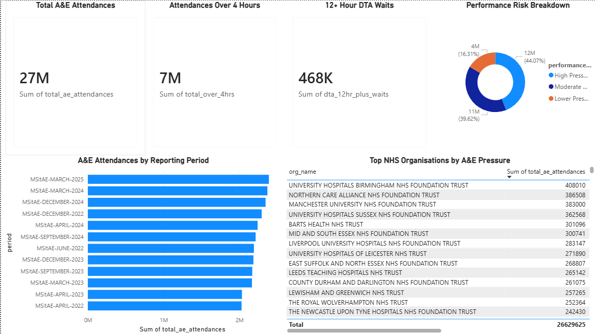

# NHS A&E Performance Analytics

A healthcare analytics project using **Python, SQL and Power BI** to analyse NHS A&E performance, waiting times and service-pressure indicators.

## Dashboard Preview

## Project Overview

This project analyses NHS A&E performance data to understand attendance volumes, waiting-time pressure and emergency admission patterns across NHS organisations.

The goal is to demonstrate how public healthcare data can be cleaned, analysed and visualised into an executive dashboard for healthcare operations, public-sector reporting and performance monitoring.

## Key Results

- Combined 12 monthly NHS A&E CSV files.
- Cleaned and standardised 2,412 provider-level records.
- Removed aggregate total rows to avoid double-counting.
- Analysed A&E attendances, 4-hour wait pressure, 12+ hour DTA waits and emergency admissions.
- Built a Power BI dashboard showing key NHS A&E performance indicators.

## Business Problem

Healthcare and public-sector teams need to monitor A&E pressure, waiting-time performance and hospital demand.

This project answers:

- Which reporting periods had the highest A&E attendances?
- Which NHS organisations had the highest A&E demand?
- Which organisations had the highest 12+ hour DTA waits?
- What proportion of activity falls into high, moderate or lower pressure categories?

## Tools Used

- Python
- Pandas
- SQL
- SQLite
- Power BI
- GitHub

## Project Workflow

1. Downloaded monthly NHS A&E performance CSV files.
2. Stored raw files in the `data/raw` folder.
3. Inspected column structure using Python.
4. Cleaned and combined the data using Pandas.
5. Removed aggregate total rows to avoid double-counting.
6. Created calculated fields for total attendances, 4-hour waits, admission rates and performance risk.
7. Ran SQL queries to generate business insights.
8. Built a Power BI dashboard for healthcare performance reporting.
9. Added dashboard screenshot and documentation to GitHub.

## Dashboard Features

The Power BI dashboard includes:

- Total A&E Attendances
- Attendances Over 4 Hours
- 12+ Hour DTA Waits
- Performance Risk Breakdown
- A&E Attendances by Reporting Period
- Top NHS Organisations by A&E Pressure

## Repository Structure

data/
- raw/
- cleaned/

notebooks/
- 01_data_inspection.py
- 02_data_cleaning.py
- 03_sql_analysis.py

sql/

reports/
- sql_analysis_results.md

dashboard/
- nhs_ae_performance_dashboard.pbix

screenshots/
- dashboard_overview.png

## How to Reproduce the Analysis

1. Install the required Python packages:

`pip install pandas tabulate`

2. Run the data inspection script:

`python notebooks/01_data_inspection.py`

3. Run the data cleaning script:

`python notebooks/02_data_cleaning.py`

This creates:

`data/cleaned/cleaned_ae_performance.csv`

4. Run the SQL analysis script:

`python notebooks/03_sql_analysis.py`

This creates:

`reports/sql_analysis_results.md`

## Skills Demonstrated

- Healthcare data analysis
- Public-sector performance reporting
- Python data cleaning
- SQL business analysis
- Power BI dashboarding
- KPI reporting
- Data quality checks
- GitHub documentation

## Future Improvements

- Add more NHS monthly data for a longer trend analysis.
- Create separate pages for provider-level and national-level performance.
- Add regional breakdowns.
- Add Power BI slicers for reporting period and performance risk.
- Add more detailed analysis of 12+ hour DTA wait trends.
